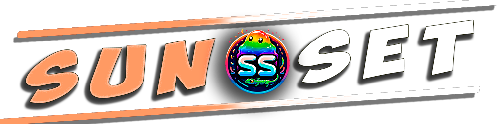

  

# 🌇 SUNSET 🌇
Space-Station 14

SUNSET — это проект с открытым исходным кодом, целью которого является создание уникальной механики и приятной игровой атмосферы в игре Space Station 14.

Игра о выживании на космической станции, где постоянно происходят столкновения между экипажем и антагонистами, созданными для того, чтобы помешать экипажу достичь своих целей. and antagonists created to prevent the crew from achieving their goals.

## Документация/Вики по космической станции 14

[На сайте документации](https://docs.spacestation14.io/) Space-Station 14 есть документация, посвященная контенту, движку, игровому дизайну и многому другому. Также у нас много ресурсов для новых участников проекта.

## Проектная деятельность

---

## Лицензия

> [!NOTE]
> Процесс перелицензирования продолжается. Лицензия Starlight Fork License (LICENSE-Starlight.TXT) применялась к вкладам в > Starlight с 04.11.2024 (коммит 84205e38) по 28.02.2026 (коммит 01eff0f7). Эта лицензия остается в силе для вкладов, 
> сделанных в течение этого периода, до получения явного согласия на перелицензирование от соответствующих авторов. После 
> получения согласия эти вклады перелицензируются в соответствии с лицензией MIT. Все вклады, сделанные вне этого 
> диапазона, лицензируются в соответствии с лицензией MIT (LICENSE.TXT). Запросы на перелицензирование отслеживаются в 
> системе. [issue #3499](https://github.com/ss14Starlight/space-station-14/issues/3499).

### Нажмите на каждый баннер для получения дополнительной информации.

---

>Некоторые файлы распространяются под лицензией [MIT license](https://opensource.org/license/MIT), Эти файлы содержат код игры Space Wizards Federation.

>Все остальные ресурсы STARLIGHT, не являющиеся кодом, включая значки и звуковые файлы, распространяются под лицензией [Creative Commons 3.0 BY-SA](https://creativecommons.org/licenses/by-sa/3.0/), если иное не указано в папке или файле.

